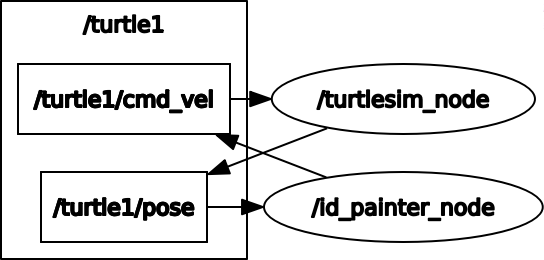
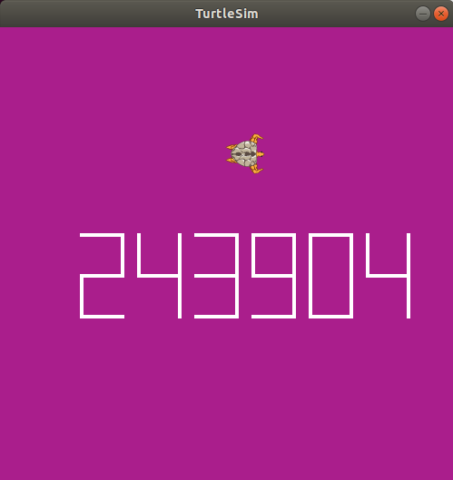
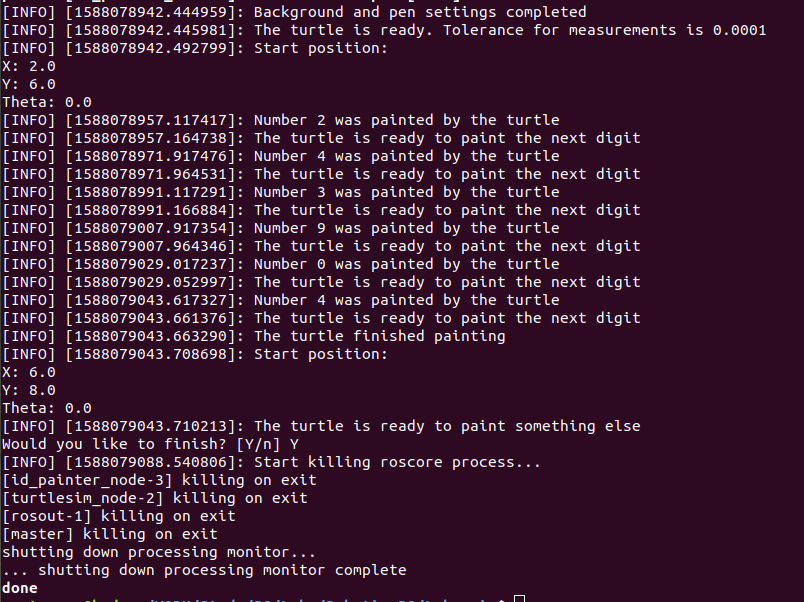

# ЛАБОРАТОРНАЯ РАБОТА №3. ROS TURTLESIM  
**Выполнил:**  
Антропов Никита  
Группа R3325  

**Вызов скрипта:**  
Setup.sh [DIRECOTRY]  

**ОПИСАНИЕ СКРИПТА Setup.sh:**  
Настройка рабочего окружения turtle_ws и запуск программы через roslaunch. При вызове указывается путь до рабочего окружения. Если при вызове скрипта целевой каталог не указан, используется текущая рабочая директория.  

**ОПИСАНИЕ ПАКЕТА id_painter:**  
Реализация алгоритма движения черепахи для отрисовки табельного номера. Пакет расположен в папке turtle_ws/src и содержит два скрипта - IdPainter.py и TurtleMove.py.  
Скрипт TurtleMove.py содержит родительский класс TurtleMove, реализующий инициализацию узла, подписчиков и издателя, а также методы движения черепахи по прямой линии и вращения вокруг собственной оси.  
Скрипт IdPainter.py содержит дочерний класс IdPainter, реализующий настройку параметров окна Turtlesim и алгоритм отрисовки отдельных цифр из табельного номера.  
Для запуска узлов в папке launch содержится загрузочный файл turtle_bot.launch.  

**ОПИСАНИЕ ОШИБОК:**  
| № |      Сообщение об ошибке     |                                           Описание                                           |
|:-:|:----------------------------:|:--------------------------------------------------------------------------------------------:|
| 1 | Expected directory, not file | Параметр [DIRECTORY] получил на вход путь  до файла, а не каталога. Скрипт завершает  работу |
| 2 | No such directory            | Указанного в параметре [DIRECTORY] каталога  не существует. Скрипт завершает работу          |
| 3 | Killing process failed       | Системная ошибка при попытке завершить  процесс. Процесс необходимо завершить  вручную       |
| 4 | Operation was interrupted    | Узел завершил работу. Остановка выполнения сценария данного узла.                            |  

**РЕЗУЛЬТАТ:**  
Граф взаимодействия узлов представлен на рисунке №1  
#### Граф взаимодействия узлов  
  
Результаты работы представлены на рисунках №2 и №3  
#### Табельный номер  
  
#### Вывод логов в терминал  
  

