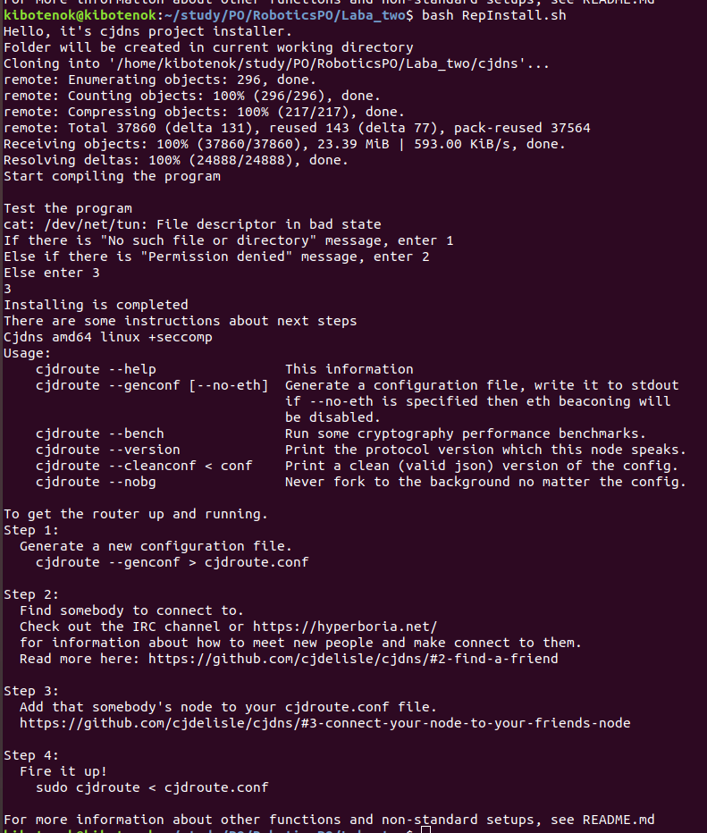

# ЛАБОРАТОРНАЯ РАБОТА №2. УСТАНОВКА ПРОЕКТА С УДАЛЕННОГО РЕПОЗИТОРИЯ  
**ВЫПОЛНИЛ:**  
Антропов Никита  
Группа R3325  

**ВЫЗОВ СКРИПТА:**  
RepInstaller.sh [DIRECTORY]  

**ОПИСАНИЕ СКРИПТА:**  
Загрузка проекта "CJDNS" с удаленного репозитория и его последующая компиляция. Автоматическая установка необходимых пакетов и зависимостей. Проверка корректности установки полученной программы и вывод встроенной инструкции с дальнейшими шагами по запуску и настройке программы. В качестве аргумента передается путь до целевого каталога, куда будет загружен проект. Если при вызове скрипта целевой каталог не указан, используется текущая рабочая директория.  

**ОПИСАНИЕ ПРОЕКТА:**  
Проект [CJDNS](https://github.com/cjdelisle/cjdns) - реализация сетевого протокола. Согласно официальной документации, протокол представляет собой зашифрованную сеть IPv6, которая использует криптографию с открытым ключом для распределения адресов и распределенную хеш-таблицу для маршрутизации. Это позволяет создавать масштабируемую и простую в настройке сеть. Может работать в двух режимах - через Интернет и в локальной сети (через Ethernet, Wi-Fi, Bluetooth).  

**ОПИСАНИЕ ДОПОЛНИТЕЛЬНЫХ ПАКЕТОВ:**  
|Пакет|Описание|
|-----|--------|
|[python2.7](https://docs.python.org/2/tutorial/index.html)| Высокоуровневый интерпретируемый язык программирования. На данный момент поддержка всех версий Python2.x прекращена|
|[build-essential](https://packages.debian.org/sid/build-essential)| Пакет, содержащий инструменты для сборки пакетов из исходного кода. Инструменты представляют собой ссылки на пакеты, которые считаются необходимыми для сборки программ|
|[git](https://git-scm.com/)| Бесплатная распределенная система контроля версий с открытым исходным кодом|
|[nodejs](https://nodejs.org/en/about/)| Кроссплатформенная среда выполнения для JavaScript с открытым исходным кодом, работающая на базе движка JavaScript V8 браузера Google Chrome|

**ОПИСАНИЕ ОШИБОК:**  
|№|Ошибка|Описание|
|-|------|--------|
|1|Expected directory, not file|Параметр [DIRECTORY] получил на вход путь до файла, а не каталога. Скрипт завершает работу|
|2|No such directory|Указанного в параметре [DIRECTORY] каталога не существует. Скрипт завершает работу|
|3|Package [NAME] not found|Необходимый пакет не найден в системе. Устанавливается автоматически после ввода пароля пользователя|
|4|Permission denied|Отказано в праве доступа при тестовом запуске программы. В документации дана следующая рекомендация: "Вы скорее всего используете виртуальный сервер (VPS) на основе технологии виртуализации OpenVZ. Попросите своего провайдера услуг включить TUN/TAP устройство, это стандартный протокол, ваш провайдер должен быть в курсе"|

**РЕЗУЛЬТАТ:**  
Результат работы скрипта представлен на рисунке 1  
#### Вывод сообщений о завершении установки  

